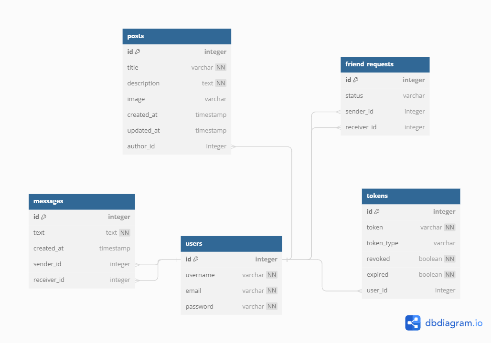

# RESTful API для социальной медиа платформы
### Описание проекта
Данное API предоставляет возможности для регистрации и аутентификации пользователей, создания постов, общения и взаимодействия пользователей между собой, а также подписки на других пользователей и просмотра ленты активности.

### Цели и основные требования:

#### Техническое задание: SocialMedia API

Цель проекта: РазработатьRESTful API для социальной медиа платформы, позволяющей пользователям регистрироваться, входить в систему, создавать посты, переписываться, подписываться на других пользователей и получать свою ленту активности.

##### Требования:
1.  Аутентификация и авторизация:  
  - Пользователи могут зарегистрироваться, указав имя пользователя, электронную почту и пароль. Регистрация должна быть по почте
  - Пользователи могут войти в систему, предоставив правильные учетные данные.
  - API должен обеспечивать защиту конфиденциальности пользовательских данных, включая хэширование паролей и использование JWT.
1.  Управление постами:
  - Пользователи могут создавать новые посты, указывая текст, заголовок и прикрепляя изображения.
  - Пользователи могут просматривать посты других пользователей.
  - Пользователи могут обновлять и удалять свои собственные посты.
2. Взаимодействие пользователей:
  - Пользователи могут отправлять заявки в друзья другим пользователям. С этого момента, пользователь, отправивший заявку, остается подписчиком до тех пор, пока сам не откажется от подписки. Если пользователь, получивший заявку, принимает ее, оба пользователя становятся друзьями. Если отклонит, то пользователь, отправивший заявку, как и указано ранее, все равно остается подписчиком.
  - Пользователи, являющиеся друзьями, также являются подписчиками друг на друга.
  - Если один из друзей удаляет другого из друзей, то он также отписывается. Второй пользователь при этом должен остаться подписчиком.
  - Друзья могут писать друг другу сообщения (реализация чата не нужна, пользователи могу запросить переписку с помощью запрос а)
3.  Подписки и лента активности:
  - Лента активности пользователя должна отображать последние посты от пользователей, на которых он подписан.
  - Лента активности должна поддерживать пагинацию и сортировку по времени создания постов.
4.  Обработка ошибок:
  - API должно обрабатывать и возвращать понятные сообщения об ошибках при неправильном запросе или внутренних проблемах сервера.
  - API должно осуществлять валидацию введенных данных и возвращать информативные сообщения при неправильном формате
5.  Документация API:
  - API должно быть хорошо задокументировано с использованием инструментов, таких как Swagger или OpenAPI.
  - Документация должна содержать описания доступных эндпоинтов, форматы запросов и ответов, а также требования к аутентификации.

Технологии и инструменты:
- Язык программирования: Java
- Фреймворк: Spring (рекомендуется использовать SpringBoot)
- База данных: Рекомендуется использовать PostgreSQL или MySQL
- Аутентификация и авторизация: SpringSecurity
- Документация API: Swagger или OpenAPI

Ожидаемые результаты:
- Разработанное RESTful API, способное выполнять указанные требования.
- Код проекта, хорошо структурированный и документированный.
- Тесты, покрывающие основные функциональные возможности API.
- Документация API, описывающая доступные эндпоинты и их использование.

Некоторые факторы, влияющие на оценку:
- Полнота соблюдения требований;
- Масштабируемость кода и соблюдение важных принципов разработки;
- Читаемость кода.

 ### Схема базы данных  

### Архитектура
Проект реализован с использованием многоуровневой архитектуры:

##### DAO (Data Access Layer): Отвечает за взаимодействие с базами данных.
##### Business Logic Layer: Здесь находится вся логика обработки данных и основные бизнес-правила приложения.
##### API Layer: Предоставляет набор интерфейсов для взаимодействия с приложением или сервисом.
Такое разделение позволяет обеспечивать независимость каждого слоя, упрощает тестирование и масштабирование.

### Технологии и инструменты
- Язык программирования: Java
- Фреймворк: Spring (в основном SpringBoot)
- База данных: PostgreSQL
- Аутентификация и авторизация: SpringSecurity
- Документация API: Swagger
- Дополнительные инструменты: mapstruct, lombok, mockito.
### Заключение
Благодаря выбранной архитектуре и инструментам, проект обладает высокой масштабируемостью, модульностью и читаемостью кода. Это делает его устойчивым к изменениям и легко расширяемым для дальнейшего развития.

### Build
- Для запуска приложения после клонирования выполните следующие шаги:
- Создайте файл application.yml по пути api/src/main/resources.
- Заполните файл следующим содержимым (замените места заполнения на вашу информацию):
yaml
Copy code
spring:
  datasource:
    driver-class-name: org.postgresql.Driver
    url: [YOUR_DATABASE_URL]
    username: [YOUR_USERNAME]
    password: [YOUR_PASSWORD]
  initialization-mode: always
  jpa:
    - generate-ddl: true
    - show-sql: false
    - defer-datasource-initialization: true
    - properties:
      - hibernate:
        - dialect: org.hibernate.dialect.PostgreSQLDialect
        - enable_lazy_load_no_trans: true
        - format_sql: true
        - generate_statistics: false
        - jdbc:
          - time_zone: UTC
    - hibernate:
      - ddl-auto: create-drop

- jwt:
  - secret: [YOUR_SECRET_TOCKEN]
  - access_token_duration: 1200001
  - refresh_token_duration: 157634000000

- api:
  - version:
    - api/v1
 ### Внимание: 
- Никогда не коммитте файлы с приватными ключами или паролями в ваш репозиторий. Убедитесь, что application.yml добавлен в .gitignore.

Docker
- Чтобы запустить приложение с использованием Docker:
- docker build -t social-media-api .
- docker-compose up

### API документация
- Для детальной документации и тестирования API перейдите по следующему адресу: http://localhost:8080/swagger-ui/index.html#/.
### Основные эндпоинты
#### Authorization details
1. Регистрация нового пользователя
##### Endpoint: POST /api/v1/auth/register
- Описание: Создает нового пользователя.
- Ответы:
- 201: Новый пользователь создан и возвращены новые токены доступа и обновления.
- 409: Электронная почта пользователя уже занята.
- 400: Ошибка валидации.
2. Авторизация пользователя
##### Endpoint: POST /api/v1/auth/login
- Описание: Авторизация пользователя.
- Ответы:
- 200: Пользователь авторизован и возвращены новые токены доступа и обновления.
- 409: Неправильная электронная почта или пароль пользователя.
- 400: Ошибка валидации.
3. Обновление токена доступа
##### Endpoint: POST /api/v1/auth/token/refresh
- Описание: Обновление токена доступа с помощью токена обновления.
- Ответы:
- 200: Возвращен новый токен доступа.
- 409: Недействительность JWT не может быть установлена и ей не следует доверять.
- 400: Ошибка валидации.
4. Выход из системы
##### Endpoint: PUT /api/v1/auth/logout
- Описание: Выход пользователя из системы.
- Ответы:
- 200: Пользователь вышел из системы.
- 409: Недействительность JWT не может быть установлена и ей не следует доверять.
- 400: Ошибка валидации.

#### FriendRequest
1. Создание запроса в друзья
##### Endpoint: POST /api/v1/friends/users/{userReceiverId}
- Описание: Создает запрос в друзья и присваивает уникальный идентификатор.
- Ответы:
- 200: Запрос в друзья создан и вернется с ID.
- 409: ID получателя не действителен.
- 400: Неверный JSON.
2. Получение всех запросов в друзья
##### Endpoint: GET /api/v1/friends/requests
- Описание: Получает все запросы в друзья.
- Ответы:
- 200: Возвращены все запросы в друзья.
- 404: Запросы в друзья не найдены.
3. Получение списка всех друзей
##### Endpoint: GET /api/v1/friends
- Описание: Получает всех друзей.
- Ответы:
- 200: Все друзья возвращены.
- 404: Друзья не найдены.
4. Принятие всех запросов в друзья
##### Endpoint: PUT /api/v1/friends/accepts
- Описание: Принимает все запросы в друзья.
- Ответы:
- 200: Все запросы в друзья приняты.
- 400: Неверное тело запроса.
5. Принятие или отказ от одного запроса в друзья
##### Endpoint: PUT /api/v1/friends/accept
- Описание: Принимает или отказывается от одного запроса в друзья.
- Ответы:
- 200: Запрос в друзья принят.
- 400: Неверное тело запроса.
6. Удаление запроса в друзья
#####  Endpoint: DELETE /api/v1/friends/delete/{friendId} 
- Описание: Удаляет запрос в друзья.
- Ответы:
- 204: Запрос в друзья удален.
- 409: Запрос в друзья для пользователя с указанным ID не найден.

#### Message
1. Создание сообщения
##### Endpoint: POST /api/v1/messages
- Описание: Создает сообщение и присваивает ему уникальный идентификатор. Следует модели для предотвращения ошибок.
- Ответы:
- 201: Сообщение создано и вернется с ID.
- 409: Сообщение уже существует.
- 400: Неверная модель сообщения.
2. Получение сообщений чата
##### Endpoint: GET /api/v1/messages/requests-chat/{receiverFriendId}
- Описание: Получает сообщения чата с пагинацией и сортировкой.
- Параметры:
- receiverFriendId: ID получателя сообщения.
- page: Номер страницы (по умолчанию 0).
- quantity: Количество сообщений на странице (по умолчанию 10).
- messageSortBy: Параметр сортировки сообщений (по умолчанию "createdAt").
- sortType: Тип сортировки (по умолчанию "ASC").
- Ответы:
- 200: Сообщения возвращены.
- 400: Неверная страница или количество.

#### Post
1. Создание поста
##### Endpoint: POST /api/v1/posts
- Описание: Создание поста и присваивание уникального идентификатора. Следует модели для предотвращения ошибок.
- Ответы:
- 201: Пост создан и вернется с ID.
- 400: Неверный JSON.
2. Получение всех постов по ID пользователя
##### Endpoint: GET /api/v1/posts/users/{userId}/posts
- Описание: Получает все посты пользователя с пагинацией и сортировкой.
- Параметры:
- userId: ID пользователя.
- page: Номер страницы (по умолчанию 0).
- quantity: Количество постов на странице (по умолчанию 10).
- companySortBy: Параметр сортировки постов (по умолчанию "createdAt").
- sortType: Тип сортировки (по умолчанию "ASC").
- Ответы:
- 200: Посты возвращены.
- 400: Неверная страница или количество.
3. Получение поста по ID
##### Endpoint: GET /api/v1/posts/{postId}
- Описание: Получает пост по ID.
- Ответы:
- 200: Пост возвращен.
- 409: Неверный ID.
4. Обновление поста
##### Endpoint: PUT /api/v1/posts/{postId}
- Описание: Обновляет пост по ID.
- Ответы:
- 200: Пост обновлен.
- 409: Неверное тело запроса.
5. Получение всех постов по активности подписок пользователя
##### Endpoint: GET /api/v1/posts/activities
- Описание: Получает все посты по активности подписок пользователя.
- Параметры:
- page: Номер страницы (по умолчанию 0).
- quantity: Количество постов на странице (по умолчанию 10).
- activitySortBy: Параметр сортировки постов (по умолчанию "createdAt").
- sortType: Тип сортировки (по умолчанию "ASC").
- Ответы:
- 200: Посты возвращены.
- 400: Неверная страница или количество.
6. Удаление поста
##### Endpoint: DELETE /api/v1/posts/{postId}
- Описание: Удаляет пост по ID.
- Ответы:
- 204: Пост удален.
- 409: Неверный ID.
### Безопасность
#### Аутентификация и Авторизация
- JWT (JSON Web Tokens): Приложение использует JWT для аутентификации и авторизации пользователей. Это позволяет нам передавать безопасно информацию между пользователями и сервером.
- Для авторизации использовать заголовок Authorization с токеном JWT.
- Хранение Данных
- Хэширование паролей: Все пароли пользователей хэшируются перед сохранением в базе данных, что делает их невосприимчивыми к утечке.
